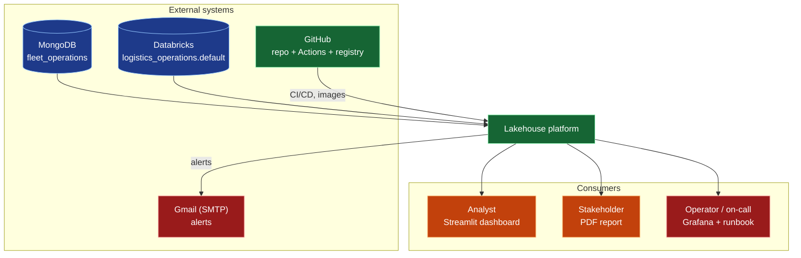
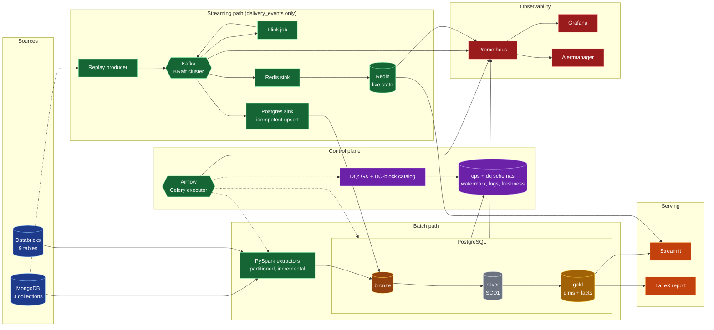
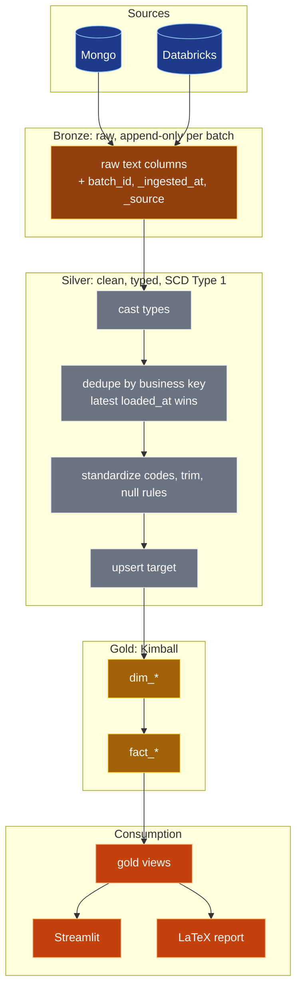
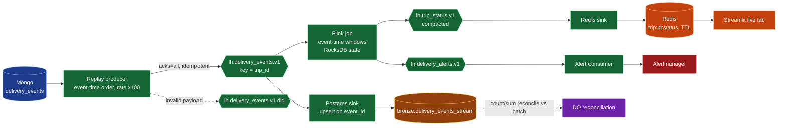
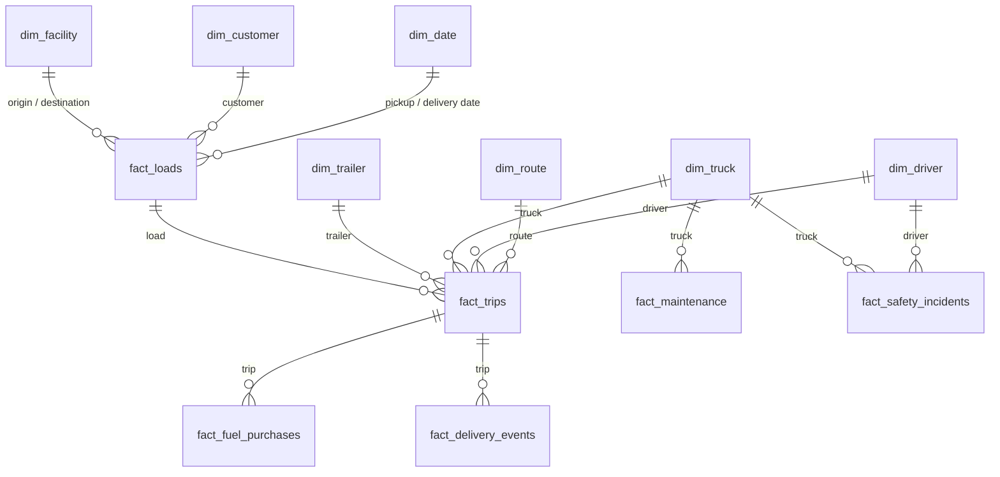
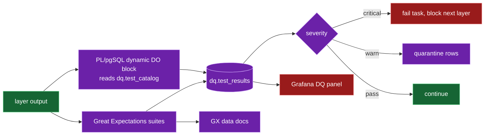
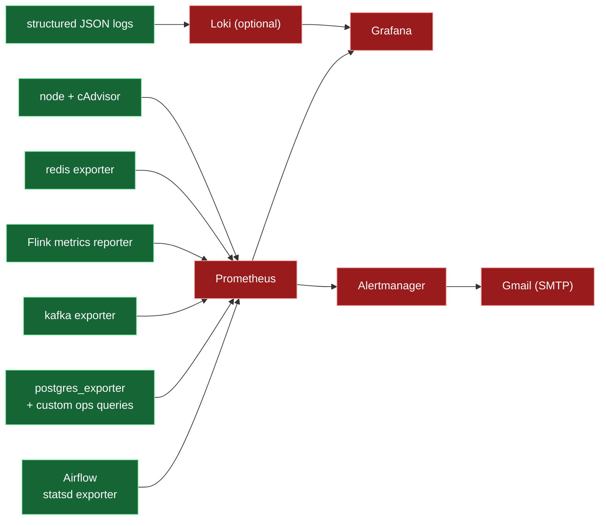
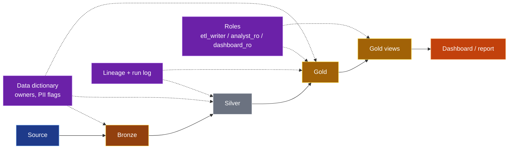

# ARCHITECTURE.md — Lakehouse Logistics Data Platform

> Production-grade, batch-first ELT platform with a Kafka/Flink speed layer.
> **MongoDB + Databricks → PySpark → PostgreSQL (PL/pgSQL layers) → Streamlit / LaTeX report**, orchestrated by Airflow, observed with Prometheus + Grafana, deployed with Docker via GitHub Actions.

| | |
|---|---|
| Status | Planning. Items marked `TBD-EDA` are decided after exploratory data analysis. |
| Supersedes | `ARCH.md` (first draft) |
| Audience | Contributors, reviewers, on-call |
| Owner | Nitin Kumar Sharma |

---

## Table of Contents

1. [Purpose and Scope](#1-purpose-and-scope)
2. [Quality Attributes and Targets](#2-quality-attributes-and-targets)
3. [Diagram Legend](#3-diagram-legend)
4. [System Context](#4-system-context)
5. [Logical Architecture](#5-logical-architecture)
6. [Data Sources and Load Strategy](#6-data-sources-and-load-strategy)
7. [Batch Pipeline](#7-batch-pipeline)
8. [Streaming Layer (Kafka + Flink)](#8-streaming-layer-kafka--flink)
9. [Orchestration (Airflow)](#9-orchestration-airflow)
10. [PostgreSQL Warehouse Design](#10-postgresql-warehouse-design)
11. [Data Quality](#11-data-quality)
12. [Idempotency and Delivery Semantics](#12-idempotency-and-delivery-semantics)
13. [Observability, SLI, SLO, SLA](#13-observability-sli-slo-sla)
14. [Security and Governance](#14-security-and-governance)
15. [Deployment and CI/CD](#15-deployment-and-cicd)
16. [Scalability Plan](#16-scalability-plan)
17. [Reliability, Backup and Recovery](#17-reliability-backup-and-recovery)
18. [Testing Strategy](#18-testing-strategy)
19. [Source Organization](#19-source-organization)
20. [Key Dependencies](#20-key-dependencies)
21. [Design Decisions (ADR log)](#21-design-decisions-adr-log)
22. [Platform Invariants](#22-platform-invariants)
23. [Open Questions](#23-open-questions)
24. [Roadmap](#24-roadmap)

---

## 1. Purpose and Scope

**Purpose.** Turn raw logistics operations data (loads, trips, drivers, trucks, fuel, maintenance, safety, delivery events) into trustworthy, fresh, reportable dimensional models, with full operational controls.

**In scope**

- Batch ELT from MongoDB and Databricks into PostgreSQL using `loaded_at` watermarks.
- Transformations as layered PL/pgSQL procedures (bronze, silver, gold).
- Streaming path for `delivery_events` (Kafka, Flink, Redis) feeding a live dashboard tab.
- Data quality gates, SLA/SLO/freshness tracking, structured ETL logging.
- Streamlit dashboard and LaTeX PDF report from the gold layer.
- Monitoring, alerting, CI/CD, and a reproducible Docker deployment.

**Out of scope**

- ML and forecasting.
- Multi-tenant access control.
- Cloud IaC (a later phase; the design stays portable to it).
- Replacing MongoDB or Databricks as systems of record.

---

## 2. Quality Attributes and Targets

Targets are starting values. Tune them after the first full-volume runs.

| Attribute | Requirement | How it is met |
|---|---|---|
| **Correctness** | Reports reconcile to sources | Reconciliation tests per layer, grain constraints |
| **Idempotency** | Any run can be retried or backfilled safely | `batch_id`, upserts, delete-insert by partition, table swap |
| **Freshness** | Gold data < 24h old by 08:00 daily; live tab < 60s behind | Freshness table, Kafka lag alerts |
| **Reliability** | ≥ 99% daily run success over 30 days | Retries, DQ gates, DLQ, backups |
| **Scalability** | 10x data growth without redesign | Partitioned reads, partitioned tables, horizontal workers, consumer groups |
| **Observability** | Every failure is visible within 5 minutes | Prometheus, Grafana, Alertmanager, structured logs |
| **Security** | Least privilege, no secrets in repo | Role separation, secrets management, network isolation |
| **Portability** | `make up` works on Linux, macOS, Windows | Docker Compose, Bash and PowerShell wrappers |
| **Maintainability** | Add a table or test without touching core code | Data-driven DQ catalog, per-table procedure convention |

---

## 3. Diagram Legend

| Color | Meaning |
|---|---|
| Blue | Sources |
| Brown | Bronze (raw) |
| Grey | Silver (clean) |
| Gold | Gold (dims and facts) |
| Green | Orchestration, compute, messaging |
| Purple | Quality and governance |
| Red | Monitoring and alerting |
| Orange | Serving and reporting |

---

## 4. System Context



---

## 5. Logical Architecture



**Key architectural stance:** the batch path is the system of record for gold. The streaming path is a side branch that powers the live tab and is reconciled against batch. Turning Kafka off never breaks reports.

---

## 6. Data Sources and Load Strategy

### 6.1 Sources

| Source | Location | Objects | Notes |
|---|---|---|---|
| MongoDB (local) | `fleet_operations` | `delivery_events`, `maintenance_records`, `safety_incidents` | From CSV; `loaded_at` available |
| Databricks | `logistics_operations.default` | `customers`, `drivers`, `facilities`, `fuel_purchases`, `loads`, `routes`, `trailers`, `trips`, `trucks` | One table per CSV, all columns STRING; `loaded_at` available |

### 6.2 Load Mode per Table

The owner decides the final mode after EDA. Defaults below are proposals.

| Table | Mode (proposed) | Silver strategy | Final `TBD-EDA` |
|---|---|---|---|
| delivery_events | Incremental on `loaded_at` | Upsert on event key | |
| maintenance_records | Incremental | Upsert (SCD1) | |
| safety_incidents | Incremental | Upsert (SCD1) | |
| loads, trips, fuel_purchases | Incremental | Upsert (SCD1) | |
| customers, drivers, trucks, trailers | Incremental | Upsert (SCD1) | |
| facilities, routes | Full (truncate and reload via staging swap) | Replace | |

Decision rule: full load only when the table is small and has no trustworthy `loaded_at`. Everything else is incremental.

### 6.3 EDA Gate (before any build)

For each of the 12 sources, record in `eda/findings.md`: row count, business key candidates and uniqueness, `loaded_at` null rate and monotonicity, late-arrival lag distribution, null and cardinality profile, parseability of STRING columns into target types, orphan foreign keys. These findings fix grains, keys, and the load-mode table above.

---

## 7. Batch Pipeline



### 7.1 Extraction (PySpark)

| Concern | Design |
|---|---|
| Incremental filter | `loaded_at > last_watermark - overlap` pushed down to the source |
| Overlap window | Configurable (default 1h) to catch late `loaded_at`; absorbed by idempotent upserts |
| Parallelism | Partitioned JDBC reads (numeric or date bounds); Mongo partitioner on `_id` ranges |
| Chunking | Time-windowed chunks so memory stays bounded and retries redo only one chunk |
| Write path | Batched `COPY` (preferred) or JDBC `batchsize` into bronze |
| Schema | All bronze columns text; typing happens in silver, so bad values never block ingestion |
| Console UX | Rich progress bars; Spark and py4j log noise suppressed |
| Config | One YAML per source/table: mode, key, watermark column, partitions, chunk size |

### 7.2 Bronze Rules

- Append-only per `batch_id`; a retry first deletes that `batch_id`, then reinserts.
- Retention: keep N days or N batches (configurable), then purge. Silver is the durable record.
- Bad rows are never dropped here; they are filtered or quarantined at silver.

### 7.3 Silver Rules

- One procedure per table: `silver.load_<table>(p_batch_id text)`.
- Dedupe with `ROW_NUMBER() OVER (PARTITION BY business_key ORDER BY loaded_at DESC)`.
- Upsert with `MERGE` (PG15+) or `INSERT ... ON CONFLICT DO UPDATE ... WHERE excluded.loaded_at >= target.loaded_at`.
- Rows failing type casts or critical rules go to `dq.quarantine_<table>` with a reason code.

### 7.4 Gold Rules

- Dims: stable surrogate keys, unknown member row `-1`, upsert on business key (SCD1).
- Facts: declared grain, unique constraint on the grain, FK to dims (unknown member for misses).
- Facts load by delete-insert on a date partition (or `batch_id`) inside a single transaction.
- Dashboards and reports read only gold views (stable contract).

---

## 8. Streaming Layer (Kafka + Flink)

### 8.1 Scope and Positioning

Streaming handles `delivery_events` only. It is an operational/live view; the batch path remains authoritative. The source data is historical, so a **replay producer** simulates live traffic at an accelerated rate. State this plainly in the README.



### 8.2 Topics

| Topic | Key | Partitions (prod) | Cleanup | Retention | Purpose |
|---|---|---|---|---|---|
| `lh.delivery_events.v1` | `trip_id` | 6 | delete | 7 days | Raw delivery events |
| `lh.delivery_events.v1.dlq` | `trip_id` | 1 | delete | 30 days | Invalid or unprocessable messages with error headers |
| `lh.trip_status.v1` | `trip_id` | 6 | **compact** | infinite (compacted) | Latest status per trip; rebuildable live state |
| `lh.delivery_alerts.v1` | `trip_id` | 3 | delete | 7 days | Delay and anomaly alerts |

Naming: `lh.<entity>.<version>`. Breaking schema changes create a new `v2` topic and run in parallel until consumers migrate.

### 8.3 Reliability Settings

| Layer | Setting | Value |
|---|---|---|
| Broker | Mode | KRaft (no ZooKeeper) |
| Broker | Replication factor | 1 local, **3 prod** |
| Broker | `min.insync.replicas` | 2 in prod |
| Broker | `unclean.leader.election.enable` | false |
| Producer | `acks` | `all` |
| Producer | `enable.idempotence` | true |
| Producer | Compression | `zstd` or `lz4` |
| Producer | Batching | `linger.ms` 20–50, tuned with load tests |
| Consumer | Offset commit | Manual, **after** successful sink write |
| Consumer | `auto.offset.reset` | `earliest` for sinks (safe because upserts are idempotent) |
| Consumer | Isolation | Each sink in its own consumer group |

### 8.4 Message Contract

```json
{
  "event_id": "string, unique",
  "trip_id": "string",
  "event_type": "string",
  "event_ts": "ISO-8601 UTC, event time",
  "payload": { },
  "schema_version": 1,
  "source": "replay-producer",
  "produced_at": "ISO-8601 UTC"
}
```

- JSON validated against a JSON Schema in the producer and in each consumer. Invalid messages go to the DLQ with headers: `error_reason`, `original_topic`, `original_offset`, `failed_at`.
- Upgrade path: Avro or Protobuf plus Schema Registry with backward-compatible evolution once more than one team consumes the topics.

### 8.5 Flink Job Design

| Concern | Design |
|---|---|
| Time semantics | Event time from `event_ts` |
| Watermarks | Bounded out-of-orderness (default 30s, tunable) |
| Late data | Allowed lateness window; later events go to a side output and the alert topic |
| State | Keyed by `trip_id`; RocksDB backend in prod |
| Checkpoints | Every 60s, retained externally on a volume (object store in cloud) |
| Delivery | Source offsets stored in checkpoints; sinks idempotent (key = `trip_id` or `event_id`) |
| Logic | Latest status per trip, delay vs planned time, events per minute, stuck-trip detection (no event for N minutes) |
| Parallelism | Equals topic partition count; scale by raising partitions and parallelism together |

If operating a Flink cluster is too heavy for the target environment, Spark Structured Streaming is an acceptable substitute that reuses existing PySpark skills. The topic design above does not change.

### 8.6 Streaming and Batch Interaction

- The stream never writes to silver or gold. It writes only to `bronze.delivery_events_stream` and Redis.
- Reconciliation task (Airflow) compares stream and batch counts per day. Differences beyond a threshold raise a warning alert.
- Backfill or replay: reset consumer group offsets, or re-run the replay producer for a date range. Sinks are idempotent, so duplicates are harmless.

### 8.7 Redis Usage (two separate concerns)

| Use | Instance / DB | Persistence |
|---|---|---|
| Live trip state for Streamlit | Instance A | AOF off, TTL on keys, rebuildable from compacted topic |
| Airflow Celery broker | Instance B (separate) | AOF on |

Never share one Redis between the cache and the Celery broker: an eviction policy suited to a cache can silently drop Celery tasks.

---

## 9. Orchestration (Airflow)

### 9.1 Execution Model

| Setting | Choice |
|---|---|
| Executor | CeleryExecutor (Redis broker, Postgres metadata DB), horizontally scalable workers |
| Run identity | `run_id` is the pipeline `batch_id` |
| Retries | 3 with exponential backoff on extract tasks; 1 on SQL transform tasks (fail fast, investigate) |
| Concurrency | Pools: `spark_extract`, `pg_transform`, `dq` to prevent overload |
| SLAs | Per-DAG deadline callbacks feed `ops.slo_status` |
| Catchup | Disabled by default; backfills run via explicit `airflow dags backfill` |
| Datasets | Batch DAG publishes a dataset that triggers DQ-nightly and report DAGs |

### 9.2 Main DAG Dependencies

```mermaid
flowchart LR
    START([start]) --> PRE["preflight<br/>connections, locks, disk"]
    PRE --> WM["read watermarks"]

    WM --> E1["extract_mongo"]
    WM --> E2["extract_databricks_incremental"]
    WM --> E3["extract_databricks_full"]

    E1 --> BG
    E2 --> BG
    E3 --> BG
    BG{{"bronze DQ gate"}}

    BG --> SIL["silver.run_all()"]
    SIL --> SG{{"silver DQ gate<br/>GX + DO-block"}}

    SG --> DM["gold.load_dims()"]
    DM --> FT["gold.load_facts()"]
    FT --> GG{{"gold DQ gate<br/>FK, grain, reconciliation"}}

    GG --> RC["stream vs batch reconcile"]
    GG --> FR["update freshness + SLO"]
    FR --> WMU["advance watermarks"]
    WMU --> REP["build LaTeX report"]
    WMU --> DSH["refresh dashboard cache"]
    REP --> END([end])
    DSH --> END
    RC --> END

    BG -. fail .-> QA["quarantine + alert"]
    SG -. fail .-> QA
    GG -. fail .-> QA

    classDef orch fill:#166534,stroke:#86efac,color:#fff
    classDef qual fill:#6b21a8,stroke:#d8b4fe,color:#fff
    classDef silver fill:#6b7280,stroke:#e5e7eb,color:#fff
    classDef gold fill:#a16207,stroke:#fde047,color:#fff
    classDef mon fill:#991b1b,stroke:#fca5a5,color:#fff
    classDef serve fill:#c2410c,stroke:#fdba74,color:#fff
    class PRE,WM,E1,E2,E3,FR,WMU,RC orch
    class BG,SG,GG qual
    class SIL silver
    class DM,FT gold
    class QA mon
    class REP,DSH serve
```



### 9.3 DAG Catalog

| DAG | Schedule | Trigger | Purpose |
|---|---|---|---|
| `lh_daily_batch` | Daily cron | Time | Main ELT pipeline |
| `lh_dq_nightly` | After batch | Dataset | Heavier GX suites, trend checks |
| `lh_report_publish` | After batch | Dataset | LaTeX build, artifact publish |
| `lh_stream_replay` | None | Manual | Start replay producer for a date range |
| `lh_stream_reconcile` | Hourly | Time | Stream vs batch count check |
| `lh_maintenance` | Weekly | Time | Retention purge, `VACUUM`/`ANALYZE`, partition creation |
| `lh_backfill` | None | Manual | Parameterized date-range rerun |

### 9.4 Rules

- DAGs contain no business logic; they call Python entry points and SQL procedures.
- Watermarks advance only in the final task after all gates pass.
- Secrets come from Airflow connections or environment, never DAG code.
- Task callbacks write start, end, rows, and status into `ops.etl_run_log` / `ops.etl_step_log`.

---

## 10. PostgreSQL Warehouse Design

### 10.1 Schemas

| Schema | Contents |
|---|---|
| `bronze` | Raw text tables plus `batch_id`, `_ingested_at`, `_source` |
| `silver` | Typed, deduplicated, SCD1 tables and their load procedures |
| `gold` | `dim_*`, `fact_*`, reporting views |
| `ops` | `watermark`, `etl_run_log`, `etl_step_log`, `freshness`, `slo_status` |
| `dq` | `test_catalog`, `test_results`, `quarantine_*` |

### 10.2 Procedure Conventions

- Names: `silver.load_<table>(p_batch_id text)`, `gold.load_dim_<name>()`, `gold.load_fact_<name>(p_batch_id text)`.
- Orchestrator procedures (`silver.run_all`, `gold.load_dims`, `gold.load_facts`) only call per-table procedures.
- Each procedure logs start, end, rows in, rows out, status, and error text to `ops.etl_step_log`.
- Exceptions are caught, logged, then re-raised so Airflow marks the task failed.
- Dynamic SQL always uses `format()` with `%I` (identifiers) and `%L` (literals).
- No dependence on `now()` for business logic; use the run's logical date.

### 10.3 Star Schema (grain confirmed in EDA)



| Fact | Grain (proposed, confirm) |
|---|---|
| `fact_loads` | One row per load |
| `fact_trips` | One row per trip |
| `fact_fuel_purchases` | One row per fuel purchase |
| `fact_delivery_events` | One row per delivery event |
| `fact_maintenance` | One row per maintenance record |
| `fact_safety_incidents` | One row per incident |

### 10.4 Performance and Scale Features

| Feature | Use |
|---|---|
| Declarative partitioning | Range partition large facts and bronze by date; drop old partitions instead of `DELETE` |
| Indexing | Unique index on each grain; BRIN on date columns of big facts; B-tree on FKs used in joins |
| Connection pooling | PgBouncer in transaction mode in front of Postgres for Streamlit and Airflow |
| Bulk load | `COPY`, `UNLOGGED` staging tables for full-load swaps |
| Maintenance | Autovacuum tuned for hot tables; scheduled `ANALYZE` after loads |
| Read scaling | Streaming replica for dashboard queries when load requires it |
| Materialized views | Heavy report aggregates refreshed after gold gate (`REFRESH ... CONCURRENTLY`) |
| Observability | `pg_stat_statements`, `postgres_exporter` |

### 10.5 Migrations

Versioned DDL with Flyway (or Sqitch). Files are immutable once merged; changes are new migrations. CI applies all migrations to a clean database on every PR.

---

## 11. Data Quality



### 11.1 Catalog-Driven Tests

`dq.test_catalog(test_id, layer, schema_name, table_name, column_name, test_type, params, severity, enabled)`. One dynamic `DO` block loops enabled rows and runs each check with `EXECUTE format(...)`. Adding a test is an `INSERT`.

### 11.2 Check Types

| Type | Examples | Layers |
|---|---|---|
| Completeness | Not-null on keys and required fields | Bronze, silver, gold |
| Uniqueness | Business key unique; grain unique | Silver, gold |
| Validity | Ranges, allowed values, date ordering (`delivery >= pickup`) | Silver, gold |
| Referential | Fact FKs resolve to dims | Gold |
| Reconciliation | Row counts and sums across layers and stream vs batch | All |
| Freshness | `max(loaded_at)` within threshold | Bronze, gold |
| Volume anomaly | Row count within band of trailing average | Bronze |
| Schema drift | Columns and types match contract | Bronze, gold views |

### 11.3 Severity Policy

| Severity | Effect |
|---|---|
| Critical | Task fails, next layer blocked, watermark not advanced, page |
| Warn | Rows quarantined or flagged, pipeline continues, ticket-level alert |
| Info | Logged for trends only |

---

## 12. Idempotency and Delivery Semantics

| Stage | Mechanism | Result |
|---|---|---|
| Extract | Watermark with overlap; `batch_id` stamped | Re-extract is safe |
| Bronze | Delete by `batch_id`, reinsert | No duplicates on retry |
| Silver | Upsert with `loaded_at` guard | Replay yields same state |
| Gold dims | Upsert on business key, stable surrogate | Same |
| Gold facts | Delete-insert by partition in one transaction | Atomic, repeatable |
| Full-load tables | Stage, validate, swap in one transaction | Never empty mid-run |
| Kafka produce | Idempotent producer, `acks=all` | No producer duplicates |
| Kafka consume | At-least-once plus idempotent sinks (`event_id`, `trip_id`) | Effectively exactly-once |
| Watermark | Advances last, only on success | No silent data loss |

**Idempotency test (CI):** run the pipeline twice on the same input and assert identical row counts and checksums in silver and gold.

---

## 13. Observability, SLI, SLO, SLA

### 13.1 Pipeline



### 13.2 SLIs and SLOs

| SLI | SLO | Source |
|---|---|---|
| Daily run success | ≥ 99% over 30 days | `ops.etl_run_log` |
| Gold freshness | Data < 24h old at 08:00 | `ops.freshness` |
| Batch duration | p95 < 30 min | `ops.etl_run_log` |
| DQ pass rate | 100% critical, ≥ 98% warn | `dq.test_results` |
| Stream lag | Consumer lag < 60s p95 | Kafka exporter |
| Stream vs batch drift | < 0.5% daily count difference | Reconcile DAG |
| Dashboard availability | ≥ 99% | Blackbox probe |

**SLA** is the external commitment (the dashboard and report are current by a fixed daily time). **SLOs** are the stricter internal targets that protect it. An error budget panel in Grafana shows remaining budget per SLO.

### 13.3 Alerts

| Alert | Condition | Severity |
|---|---|---|
| Pipeline failed | DAG run failed | Page |
| Freshness breach | Gold > 24h old | Page |
| DQ critical fail | Any critical test fails | Page |
| Batch slow | Duration > 2x p95 | Warn |
| Kafka lag high | Lag > 5 min for 10 min | Warn |
| DLQ growing | DLQ rate > threshold | Warn |
| Flink checkpoint failing | Consecutive failures | Page |
| Disk or DB connections high | > 80% | Warn |

### 13.4 Logging

- JSON structured logs with `run_id`/`batch_id`, `layer`, `table`, `step`, `rows_in`, `rows_out`, `duration_ms`, `status`.
- Same fields persisted in `ops.etl_step_log`, so logs and tables agree.
- Every alert links to a runbook entry.


### 13.5 Alert Delivery (Gmail)

- Alerts go out by Gmail SMTP (`smtp.gmail.com:587`, STARTTLS) using a Google **App Password** (needs 2-Step Verification). Never use the account password.
- Airflow uses its built-in `email_on_failure` with the SMTP settings; Alertmanager uses the same account via its `email_configs` receiver.
- Personal Gmail has daily sending limits. Page by email only for critical alerts, and batch warnings into one daily digest (`ALERT_DIGEST_ENABLED`).
- Credentials live in `.env` / GitHub Secrets (see `.env.example`).

---

## 14. Security and Governance

### 14.1 Security

| Area | Control |
|---|---|
| Roles | `etl_writer` (procedures), `dq_runner`, `analyst_ro` (gold), `dashboard_ro` (gold views only) |
| Secrets | `.env` locally (gitignored), GitHub Secrets in CI, Docker secrets in deploy; gitleaks in pre-commit and CI |
| Network | Private Docker network; only Streamlit and Grafana published; Kafka and Postgres not exposed |
| Transport | TLS for external connections (Databricks, Mongo if remote); TLS/SASL for Kafka in prod |
| Images | Pinned versions, minimal base images, Trivy scan in CI, non-root containers |
| Dependencies | `uv.lock` committed; Dependabot/Renovate enabled |
| Audit | Row-level change history not required (SCD1); run and DQ logs are the audit trail |

### 14.2 Governance

| Area | Practice |
|---|---|
| Data dictionary | `docs/data_dictionary.md`: every gold column with type, meaning, source, owner |
| Lineage | Source → bronze → silver → gold documented per table; OpenLineage/Marquez is an optional upgrade |
| PII | Driver personal fields flagged; excluded from dashboard views unless required |
| Ownership | Each domain (loads, fleet, safety) has an owner listed in the dictionary |
| Retention | Bronze N days; silver and gold indefinite; Kafka per topic table above |
| Change control | PR review, migrations versioned, DQ catalog changes reviewed like code |



---

## 15. Deployment and CI/CD

### 15.1 Environments

| Env | Purpose | Notes |
|---|---|---|
| `dev` | Local developer stack | Compose profile `core` (+ `stream`, `obs` as needed), sample data |
| `ci` | Ephemeral per PR | Clean DB, migrations, tests, smoke run |
| `prod` | Production-grade deploy | Replication factor 3 for Kafka, PgBouncer, backups, TLS |

### 15.2 Docker Compose Profiles

| Profile | Services |
|---|---|
| `core` | postgres, pgbouncer, airflow (webserver, scheduler, worker), redis-broker, spark runner |
| `stream` | kafka (KRaft), flink jobmanager/taskmanager, redis-cache, producer, sinks |
| `serve` | streamlit |
| `obs` | prometheus, grafana, alertmanager, exporters |
| `all` | Everything |

Every service has a healthcheck, resource limits, restart policy, and pinned image tag.

### 15.3 CI/CD Flow

```mermaid
flowchart LR
    PR["Pull request"] --> LINT["Lint<br/>ruff, sqlfluff, gitleaks"]
    LINT --> UNIT["Unit tests"]
    UNIT --> MIG["Apply migrations<br/>to clean Postgres"]
    MIG --> SQLT["SQL procedure tests<br/>(fixtures)"]
    SQLT --> SMOKE["Smoke test<br/>tiny end-to-end run"]
    SMOKE --> IDEM["Idempotency test<br/>run twice, compare"]
    IDEM --> DQT["DQ suites"]
    DQT --> BUILD["Build + scan images<br/>Trivy"]
    BUILD --> MERGE{"All green?"}
    MERGE -- yes --> MAIN["Merge to main"]
    MAIN --> PUB["Publish images<br/>GitHub Container Registry"]
    PUB --> DEP["Deploy (compose pull + up)"]
    DEP --> POST["Post-deploy smoke + health checks"]
    MERGE -- no --> FIX["Block merge"]

    classDef orch fill:#166534,stroke:#86efac,color:#fff
    classDef qual fill:#6b21a8,stroke:#d8b4fe,color:#fff
    classDef mon fill:#991b1b,stroke:#fca5a5,color:#fff
    class PR,MAIN,PUB,DEP,BUILD orch
    class LINT,UNIT,MIG,SQLT,SMOKE,IDEM,DQT,POST,MERGE qual
    class FIX mon
```



### 15.4 Release and Rollback

- Images tagged with git SHA and semver; `latest` is never deployed.
- Migrations are forward-only; a bad release is rolled back by deploying the previous image and a compensating migration.
- Backwards-compatible schema changes first (expand), remove old columns later (contract).

### 15.5 Developer Entry Points

| Command | Action |
|---|---|
| `make up` / `make down` | Start / stop stack (profile via `PROFILE=`) |
| `make migrate` | Apply DB migrations |
| `make eda` | Run profiling scripts |
| `make run-batch` | Trigger the daily DAG once |
| `make test` | Lint, unit, SQL, smoke |
| `make dq` | Run DQ suites |
| `make report` | Build the LaTeX report |
| `make logs SVC=...` | Tail service logs |

Bash scripts (Linux/macOS) and PowerShell scripts (Windows) wrap the same Make targets.

---

## 16. Scalability Plan

### 16.1 Bottlenecks and Levers

| Component | First bottleneck | Scale lever |
|---|---|---|
| Extraction | Source read throughput, Spark memory | More partitions, smaller chunks, more executors/cores, Spark on cluster |
| Bronze load | Postgres write speed | `COPY`, partitioned bronze, `UNLOGGED` staging, parallel table loads |
| Silver/gold procedures | Large set-based upserts | Partition-wise processing, process only the batch's changed keys, indexes on keys, parallel procedures per table |
| Postgres reads | Dashboard concurrency | PgBouncer, materialized views, read replica |
| Airflow | Task concurrency | More Celery workers, pools, parallel task groups |
| Kafka | Partition throughput | More partitions (plan upfront), more brokers, compression |
| Flink | State size, parallelism | Raise parallelism with partitions, RocksDB, incremental checkpoints |
| Redis cache | Memory | TTLs, key design, cluster later if needed |
| Reports | Heavy aggregates | Pre-aggregated gold tables, scheduled refresh |

### 16.2 Design Choices That Keep Scale Cheap

- Incremental by default; full loads only for small reference tables.
- Date-partitioned facts so loads and retention touch one partition.
- Set-based SQL only; no row-by-row loops inside procedures (the DQ runner loops over the catalog, not data rows).
- Stateless workers (extractors, sinks, producer) that scale by running more copies.
- Kafka partitions chosen with headroom; raising them later breaks per-key ordering for existing keys, so decide early.

### 16.3 Capacity and Load Testing

- Record real row counts per table in EDA, then project 10x.
- Generate synthetic volume (scaled copies of the CSVs with fresh keys) to test the batch window and stream throughput.
- Track in `docs/capacity.md`: rows per layer, batch duration by stage, peak memory, Kafka msgs/sec, Postgres size growth per month.
- Pass criteria: 10x volume completes inside the SLO window, or the plan names which lever to pull.

### 16.4 Scale-Out Path (when the single host is outgrown)

1. Move Postgres to a managed or dedicated host with a replica.
2. Run Spark on a cluster (or push heavy extraction to Databricks jobs).
3. Move Kafka to a multi-broker cluster; Flink to a standalone/session cluster.
4. Airflow workers on separate hosts.
5. Replace Compose with Kubernetes manifests/Helm; Terraform for infrastructure.

The service boundaries above are already container-shaped, so these moves do not change the architecture.

---

## 17. Reliability, Backup and Recovery

### 17.1 Failure Modes

| Failure | Detection | Behavior / Recovery |
|---|---|---|
| Source unreachable | Preflight task | Fail early, retry, alert; no partial state |
| Extract partial failure | Task failure | Retry chunk; `batch_id` delete-insert keeps bronze clean |
| Bad data | DQ gate | Quarantine or block; watermark not advanced |
| Procedure error | Task failure, step log | Transaction rolls back; fix and rerun |
| Airflow worker dies | Celery/Airflow | Task rescheduled; tasks idempotent |
| Kafka broker down | Exporter, lag | Replicated topics continue; producer retries |
| Flink job crash | Checkpoint metrics | Restart from last checkpoint |
| Redis cache lost | Dashboard check | Rebuild from compacted `lh.trip_status.v1` |
| DB corruption/loss | Monitoring | Restore from backup + PITR, replay from sources |

### 17.2 Backup and DR

| Item | Method | Target |
|---|---|---|
| Postgres | Base backup + WAL archiving (pgBackRest or WAL-G) | RPO ≤ 15 min, RTO ≤ 1 h |
| Airflow metadata | Included in Postgres backup | Same |
| Kafka | Replication; topics rebuildable from Mongo replay | n/a |
| Config and code | Git | n/a |
| Restore drill | Monthly, documented in runbook | Verified |

Because bronze can be re-extracted from sources and everything downstream is deterministic, a full rebuild from sources is itself a recovery path. Document its expected duration.

### 17.3 Backfill Procedure

1. Pause the daily DAG.
2. Trigger `lh_backfill` with a date range and the table list.
3. Extract with the watermark overridden for that window.
4. Re-run silver and gold for the affected partitions (idempotent).
5. Run all DQ gates and the reconcile DAG.
6. Resume the daily DAG.

---

## 18. Testing Strategy

| Level | What | Tooling | Gate |
|---|---|---|---|
| Static | SQL and Python style, secrets | sqlfluff, ruff, gitleaks | PR |
| Unit (Python) | Config parsing, watermark math, message validation, producer/sink logic | pytest | PR |
| SQL unit | Each procedure against tiny fixtures | pgTAP or pytest + Postgres container | PR |
| Migration | All migrations apply to a clean DB | Flyway in CI | PR |
| Smoke | Stack boots, health checks pass, tiny end-to-end run | Make target | PR, post-deploy |
| Idempotency | Double run equals single run | pytest | PR |
| Data quality | GX suites, DO-block catalog | GX + `dq` | Pipeline and nightly |
| Contract | Gold view columns/types unchanged | pytest | PR |
| DAG integrity | DAGs import, no cycles, tags and owners set | pytest `DagBag` | PR |
| Streaming | Producer to sink round trip, DLQ routing, duplicate delivery | pytest + compose | PR |
| Load | Synthetic 10x volume | Scripted | Pre-release |
| Chaos (light) | Kill worker/broker mid-run, verify recovery | Manual script | Pre-release |

Rule: a failed critical test blocks promotion to the next layer in the pipeline, and a red CI blocks merge.

---

## 19. Source Organization

```
lakehouse/
├── ARCHITECTURE.md
├── README.md
├── AGENTS.md
├── Makefile
├── docker-compose.yml          # profiles: core, stream, serve, obs
├── .env.example
├── pyproject.toml              # uv-managed
├── uv.lock
├── .pre-commit-config.yaml
├── .github/workflows/
│   ├── ci.yml
│   └── release.yml
├── airflow/
│   ├── dags/
│   ├── include/                # shared helpers, callbacks
│   └── Dockerfile
├── extract/
│   ├── config/                 # per-table YAML (mode, key, watermark, partitions)
│   ├── mongo_extractor.py
│   ├── databricks_extractor.py
│   └── common/
├── sql/
│   ├── migrations/             # Flyway versioned DDL
│   ├── bronze/
│   ├── silver/                 # tables + load procedures
│   ├── gold/                   # dims, facts, views
│   ├── ops/                    # watermark, logs, freshness, slo
│   └── dq/                     # catalog, DO-block runner, quarantine
├── dq/great_expectations/
├── streaming/
│   ├── producer/
│   ├── flink/
│   ├── sinks/                  # postgres sink, redis sink, alert consumer
│   └── schemas/                # JSON Schemas
├── dashboard/                  # Streamlit app
├── report/                     # LaTeX sources and build script
├── monitoring/
│   ├── prometheus/             # prometheus.yml, rules
│   ├── alertmanager/
│   └── grafana/                # provisioned dashboards and datasources
├── scripts/
│   ├── bash/
│   └── powershell/
├── eda/                        # profiling scripts and findings.md
├── docs/
│   ├── data_dictionary.md
│   ├── runbook.md
│   ├── capacity.md
│   └── adr/
└── tests/
    ├── unit/
    ├── sql/
    ├── smoke/
    ├── streaming/
    └── load/
```

---

## 20. Key Dependencies

Pin all versions in `uv.lock` and image tags.

| Component | Role |
|---|---|
| PostgreSQL 16 | Warehouse, PL/pgSQL transformation engine |
| PgBouncer | Connection pooling |
| MongoDB | Source system |
| Databricks | Source system |
| Apache Spark / PySpark | Extraction |
| Apache Airflow (Celery) | Orchestration |
| Redis (two instances) | Celery broker; live-state cache |
| Apache Kafka (KRaft) | Event streaming |
| Apache Flink | Stream processing (Spark Structured Streaming as fallback) |
| Great Expectations | Declarative data quality |
| Flyway or Sqitch | Schema migrations |
| Streamlit | Dashboard |
| LaTeX | PDF report |
| Prometheus, Alertmanager, Grafana | Metrics, alerting, dashboards |
| Exporters (postgres, kafka, redis, node, cAdvisor) | Metric collection |
| Docker, Docker Compose | Packaging and deploy |
| GitHub Actions, GHCR | CI/CD and image registry |
| ruff, sqlfluff, pytest, pgTAP, gitleaks, Trivy | Quality and security tooling |
| uv | Python dependency management |
| Make, Bash, PowerShell | Developer entry points |

---

## 21. Design Decisions (ADR log)

| # | Decision | Rationale | Trade-off |
|---|---|---|---|
| 1 | ELT with PL/pgSQL transformations | Logic sits next to the data, testable, logged, strong SQL showcase | Less portable than dbt; needs strict conventions |
| 2 | PySpark only for extraction | Partitioned incremental reads from both sources | Heavy for tiny tables |
| 3 | Bronze all text plus `batch_id` | Ingestion never fails on bad types; replayable | More storage; typing deferred to silver |
| 4 | SCD Type 1 in silver and dims | Matches requirement, simple | No history (Type 2 can be added to `dim_customer` later) |
| 5 | Watermark advances last, with overlap window | No silent loss, handles late rows | Some reprocessing, absorbed by idempotency |
| 6 | Per-table load mode chosen by owner after EDA | Avoids wrong guesses | EDA is a hard prerequisite |
| 7 | Kafka limited to `delivery_events`; batch stays authoritative | Realistic scope, no dual-writer conflict, platform works without Kafka | Live tab is a replay of history, not true live |
| 8 | KRaft mode Kafka | Fewer moving parts, no ZooKeeper | Newer operational model |
| 9 | Flink output to a compacted topic, then Redis sink | Live state is rebuildable and decoupled from Redis | One extra small service |
| 10 | Sinks at-least-once with idempotent upserts | Simpler than exactly-once transactions, same result | Requires stable keys (`event_id`) |
| 11 | Two separate Redis instances | Cache eviction cannot drop Celery tasks | Extra container |
| 12 | CeleryExecutor | Horizontal scale of workers, matches Redis use | More components than LocalExecutor |
| 13 | Data-driven DQ catalog + dynamic DO block | Tests added by insert, central results | Dynamic SQL needs careful quoting |
| 14 | Gold views as the consumer contract | Stable interface, least privilege | One more layer to maintain |
| 15 | Flyway migrations | Reproducible schema, CI-verified | Discipline: never edit merged migrations |
| 16 | Docker Compose now, Kubernetes-ready later | Fits a single-host portfolio deploy | No auto-scaling or multi-node HA yet |
| 17 | Date-partitioned facts and bronze | Cheap loads and retention | Partition management job needed |

Detailed ADRs go in `docs/adr/NNNN-title.md` using: Context, Decision, Consequences.

---

## 22. Platform Invariants

1. Every procedure and job is idempotent: re-running a batch never changes the final state.
2. Data flows only forward: bronze → silver → gold. No layer reads from a layer above.
3. Watermarks advance only after the gold DQ gate passes.
4. All timestamps are stored and processed in UTC.
5. Every fact has a declared grain enforced by a unique constraint.
6. Every fact FK resolves to a dim row or the unknown member (`-1`).
7. The stream never writes to silver or gold.
8. Consumers (dashboard, report) read only gold views or the Redis live state.
9. Secrets never enter source control, images, or logs.
10. Dynamic SQL uses `format()` with `%I` and `%L` only.
11. Schema changes ship only as forward migrations, backward-compatible first.
12. Kafka topics are versioned; breaking changes create a new version.
13. A failing critical DQ test blocks promotion; a red CI blocks merge.
14. `make up` works on Linux, macOS, and Windows (via PowerShell wrappers).

---

## 23. Open Questions

| # | Question | Decided in |
|---|---|---|
| 1 | Final full vs incremental mode per table | EDA |
| 2 | Business keys and grains for every fact | EDA |
| 3 | Is `loaded_at` reliable and monotonic in both sources? | EDA |
| 4 | Actual data volumes and growth (drives partitioning and capacity targets) | EDA |
| 5 | Flink cluster vs Spark Structured Streaming | After the producer and sinks work |
| 6 | Need for a Postgres read replica | After load testing |
| 7 | Schema Registry and Avro now or later | When a second consumer appears |
| 8 | Which dims deserve SCD Type 2 | After report requirements are clear |
| 9 | Deploy target for the prod profile (single VM vs cloud) | Before Milestone 8 |

---

## 24. Roadmap

| Milestone | Deliverable | Exit criteria |
|---|---|---|
| M0 EDA | Profiling scripts, `findings.md`, load-mode table, grains | Section 6 and 23 items resolved |
| M1 Foundation | Compose `core`, Makefile, migrations, `ops`/`dq` schemas, CI skeleton | `make up` and CI green |
| M2 Bronze | Extractors, watermarks, bronze DQ | Incremental and full loads idempotent |
| M3 Silver | Typed, deduped SCD1 procedures, quarantine | Silver DQ gate passing |
| M4 Gold | Dims, facts, reconciliation tests | Star schema reconciles to sources |
| M5 Orchestration | Airflow DAGs, gates, retries, SLAs | Daily DAG runs end to end |
| M6 Serving | Streamlit dashboard, LaTeX report | Reports built from gold views only |
| M7 Observability | Prometheus, Grafana, alerts, runbook | Every alert has a runbook entry |
| M8 Streaming | Kafka topics, producer, Flink, sinks, Redis, live tab | Lag SLO met; reconcile drift < 0.5% |
| M9 Hardening | Load test at 10x, backup/restore drill, chaos test, security scan | Pass criteria in section 16.3 met |
| M10 Release | README, docs, ADRs, portfolio write-up | Fresh clone runs with `make up` |

Build order tip: M0 to M7 produce a complete, production-grade batch platform. M8 is additive and can be dropped without affecting anything else.
