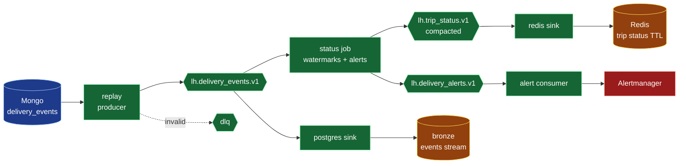

# Streaming

`delivery_events` only. The replay producer simulates live traffic at
100x from Mongo history, so state plainly that the live tab is a replay.
Batch gold stays authoritative; turning Kafka off never breaks reports.

| Topic | Key | Partitions | Cleanup | Retention |
|---|---|---|---|---|
| lh.delivery_events.v1 | trip_id | 6 | delete | 7 days |
| lh.delivery_events.v1.dlq | trip_id | 1 | delete | 30 days |
| lh.trip_status.v1 | trip_id | 6 | compact | infinite |
| lh.delivery_alerts.v1 | trip_id | 3 | delete | 7 days |

Run order: `ensure_topics.py`, replay producer, status job,
Postgres sink, Redis sink. Producer uses `acks=all` with idempotence;
every consumer commits only after its sink write, and every sink
upserts on `event_id` or `trip_id`, so replays are harmless. State
checkpoints to `FLINK_CHECKPOINT_DIR`. The stream never writes to
silver or gold. See ADR 0002 for why the runtime is a Python consumer
loop instead of a Flink cluster.
