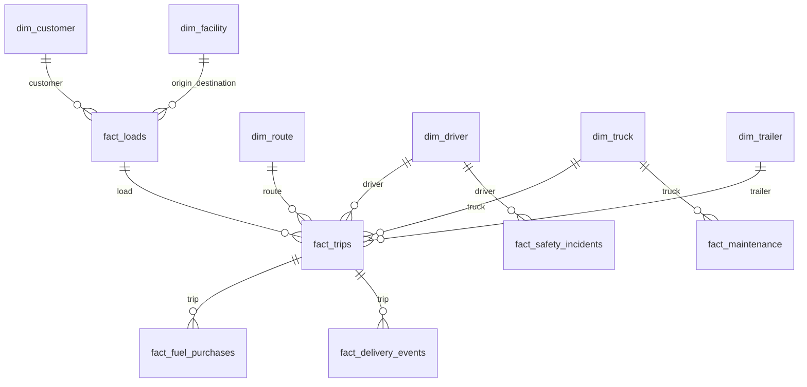
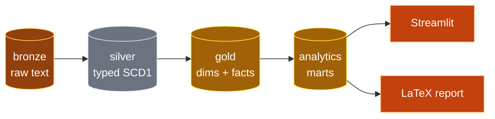

# Data dictionary

Gold is the system of record for reports. Dashboards read the
`analytics` marts, which are thin views over gold. Unknown dimension
members use surrogate `-1`. All timestamps are UTC.

## Dimensions

| Dimension | Grain | Business key | Key columns |
|---|---|---|---|
| dim_date | One row per calendar date | date_key | date_key, full_date, year, quarter, month, day, is_weekend |
| dim_customer | One row per customer | customer_id | customer_sk, customer_name, customer_type, account_status, annual_revenue_potential |
| dim_driver | One row per driver | driver_id | driver_sk, name, hire and termination dates, license, employment_status |
| dim_facility | One row per facility | facility_id | facility_sk, facility_name, type, city, state, coordinates |
| dim_route | One row per route | route_id | route_sk, origin and destination cities, distance, rates, transit days |
| dim_truck | One row per truck | truck_id | truck_sk, unit_number, make, vin, fuel_type, status |
| dim_trailer | One row per trailer | trailer_id | trailer_sk, trailer_number, type, vin, status |

## Facts

| Fact | Grain | Measures | Foreign keys |
|---|---|---|---|
| fact_loads | One row per load | weight_lbs, pieces, revenue, fuel_surcharge, accessorial_charges | customer, route, load date |
| fact_trips | One row per trip | distance, duration, fuel gallons, average mpg, idle hours | load, driver, truck, trailer, dispatch date |
| fact_fuel_purchases | One row per fuel purchase | gallons, price per gallon, total_cost | trip, truck, driver, purchase date |
| fact_delivery_events | One row per delivery event | delay and detention minutes, on_time_flag | load, trip, facility |
| fact_maintenance | One row per maintenance record | labor and parts cost, downtime hours, odometer | truck, maintenance date |
| fact_safety_incidents | One row per incident | damage costs, claim_amount, fault flags | trip, truck, driver, incident date |

## Analytics marts

| Mart | Grain | Source tables |
|---|---|---|
| fleet_kpis, load_kpis, safety_kpis | Single row | All dims and facts in scope |
| fuel_monthly, revenue_monthly, incidents_monthly, maintenance_monthly, safety_monthly | Month | Respective fact plus dim_date |
| truck_efficiency, truck_scorecard | Truck | fact_trips plus upkeep and incident aggregates |
| driver_scorecard, driver_monthly | Driver, driver and month | fact_trips plus incident aggregates |
| truck_monthly | Truck and month | fact_trips plus fact_maintenance |
| revenue_by_customer, customer_monthly | Customer, customer and month | fact_loads plus dim_customer |
| facility_delays, facility_monthly, facility_safety | Facility, facility and month | fact_delivery_events plus dim_facility |
| route_performance | Route | fact_trips through fact_loads plus dim_route |
| claims_by_type, load_mix, delay_buckets | Category | Respective fact |
| monthly_pnl | Month | Loads, fuel, upkeep, and claim aggregates |

Money columns are double precision; reconcile checks round to cents.
`on_time_rate` fields measure Delivery arrivals only, not Pickups.
`monthly_pnl` margin is directional: costs follow their own event
month, not the load month.
