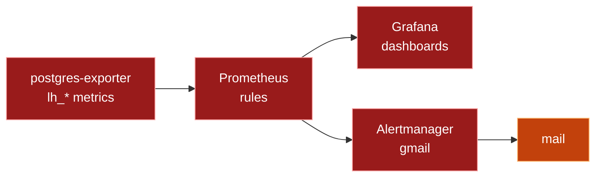

# Monitoring

Prometheus collects, Grafana shows, Alertmanager mails. Full reference
is `monitoring/README.md`; this page is the short map.

Warehouse metrics come from `ops.pipeline_run_log`, `ops.layer_snapshot`,
`ops.freshness`, and `ops.slo_status`. Page alerts fire at once, warn
alerts batch hourly. Every alert links to `docs/runbook.md`. Start with
`docker compose --profile obs up -d` after the `core` warehouse is up,
migrated, and loaded.
