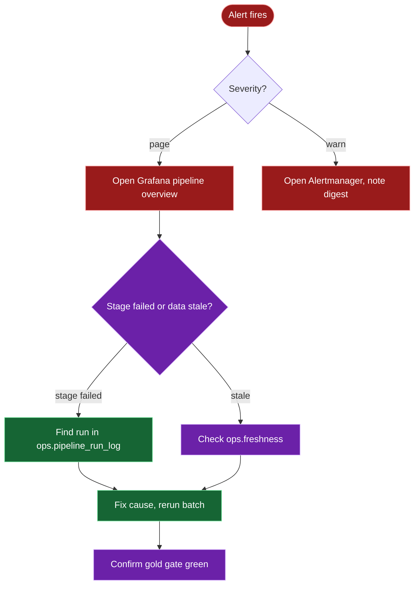

# Runbook

One entry per alert. Page means immediate mail, warn means grouped digest.
Design authority is `ARCHITECTURE.md` §13 and §17.



## PipelineStageFailed (page)

A batch stage reported failure. Check the stage, then the step log:

```sql
SELECT run_id, stage, status, detail
FROM ops.pipeline_run_log
WHERE status = 'FAILED'
ORDER BY started_at DESC LIMIT 5;
```

Retry the failed chunk only; bronze deletes by `batch_id` first, so a
retry never duplicates. If a DQ gate failed, quarantined rows sit in
`dq.quarantine_*` with a reason code. Fix the source or the rule, then
rerun the gate script. The watermark never advances on failure, so no
data is skipped.

## FreshnessBreach (page)

```sql
SELECT layer, table_name, max_loaded_at, checked_at
FROM ops.freshness
WHERE is_fresh = false;
```

If the daily DAG never ran, trigger `lh_daily_batch` and watch it go
green. If it ran but a table is stale, that table's extract wrote
nothing new; check its source system and the extract logs for the run.

## SloBreach (warn)

```sql
SELECT sli, measured, target_value, checked_at FROM ops.slo_status;
```

Informational unless it repeats daily. A repeated breach means the SLO
target no longer fits reality; retune the threshold in `.env` instead
of ignoring the mail.

## ExporterDown (warn)

Pipeline metrics are stale but the pipeline itself is fine. Check the
`obs` profile is up and the exporter credentials work:

```bash
docker compose --profile obs ps
curl localhost:9187/metrics | head -5
```

The exporter connects as `dq_runner`; a wrong `PG_DQ_PASSWORD` is the
usual cause. Passwords are set out of band, never in this repo.

## Airflow task mail

Any task mail carries the DAG id, task id, run id, and this runbook
path from the shared alert helper. Critical pages at once; warnings
batch when `ALERT_DIGEST_ENABLED` is true. If mail stops arriving,
check the Gmail App Password in `.env` before anything else.

## Stream triage

Replay lag: compare stream and batch counts for the day. Drift above
0.5% raises a warning; rewind the consumer group offsets and replay
the date range. Sinks are idempotent, so duplicates are harmless. A
lost Redis cache rebuilds from the compacted `lh.trip_status.v1`
topic. Never write stream data to silver or gold by hand.

## Backfill

Pause the daily DAG, trigger `lh_backfill` with a date range and table
list, rerun silver and gold for the affected partitions, confirm every
DQ gate plus the reconcile check, then resume the daily DAG.
